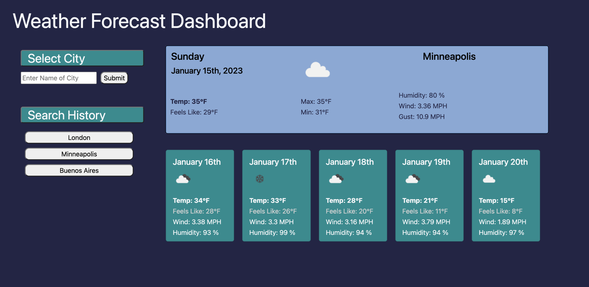

# Weather Forecast Dashboard

## User Story
AS A traveler
I WANT to see the weather outlook for multiple cities
SO THAT I can plan a trip accordingly

## Tasks
- create the layout using html, css, and bootstrap
- create user input for the city which will then save to local storage
- create a button for all cities stored in local storage that can also be used to call the weather data for that city
- use API calls to pull the location coordinates for the input city and then uses those coordinates to pull the weather data for that location
- serve the weather data on the page with each day in a separate card
- test the app to ensure it works at each point, see what happens when a user inputs info that is not an identified city (spoiler, the api pulls either something close to that name or throws an error)

## Learnings
- how to call web-based APIs
- how to pass information into my API call to make it dynamic (entering different cities gets different weather data)
- how to use code to complete math functions (converting kelvin to farenheit)
- navigating complex arrays and objects to get the specific information I need
- dynmically creating complex elements (cards vs just a button)

## Future Improvements
- change the input to require both city and state to ensure the user is getting their desired location
- define error handling if the user inputs something that the api can't handle (misspelled city or not a city at all)
- change saved city buttons to only allow one entry of each city from the user input rather than adding multiple buttons for the same location
